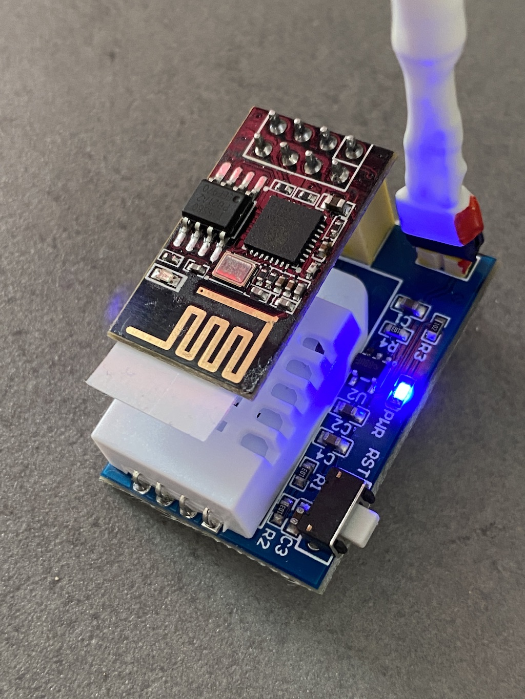

# ESP-01S + DHT22


## esphome code

```
name: esp32-dht22-02

esp8266:
  board: esp01_1m

# Enable logging
logger:

# Enable Home Assistant API
api:

ota:
  password: "864868a05abffdf5f9bb073518cd0809"

wifi:
  ssid: !secret wifi_ssid
  password: !secret wifi_password

  # Enable fallback hotspot (captive portal) in case wifi connection fails
  ap:
    ssid: "Esp32-Dht22-02 Fallback Hotspot"
    password: "WXjJplTlkNPa"

captive_portal:

sensor:
  - platform: dht
    # model: DHT22 don't work with the ESP-01S
    model: AM2302
    pin: GPIO02
    temperature:
      name: "Temperature esp01-dht22-02"
    humidity:
      name: "Humidite esp01-dht22-02"
    update_interval: 300s
```