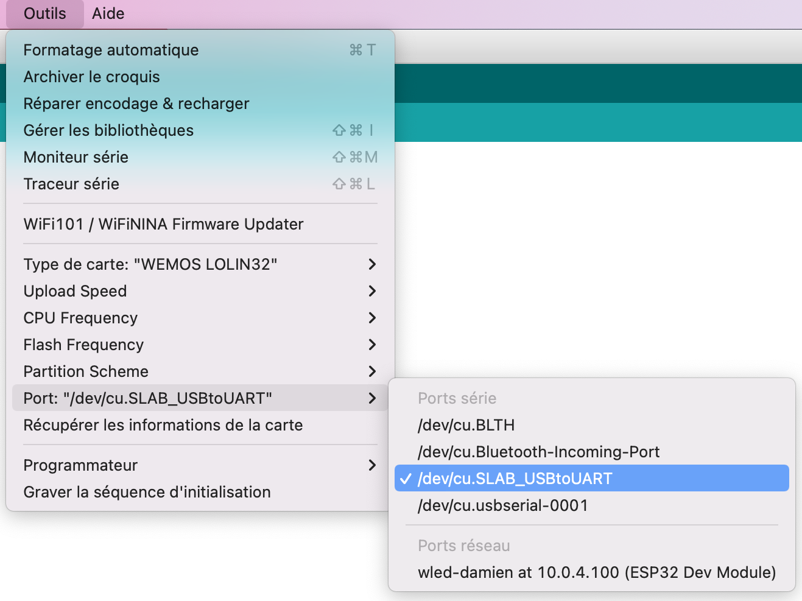

# ESP32 + DHT22 + LED +  MQTT + Home Assistant

## Extension with a Led

You can find the same project without Led [here](esp32-DHT22.md)
## USB port connection
See (FAQ)[../FAQ] if any problem

## Wire DHT22

