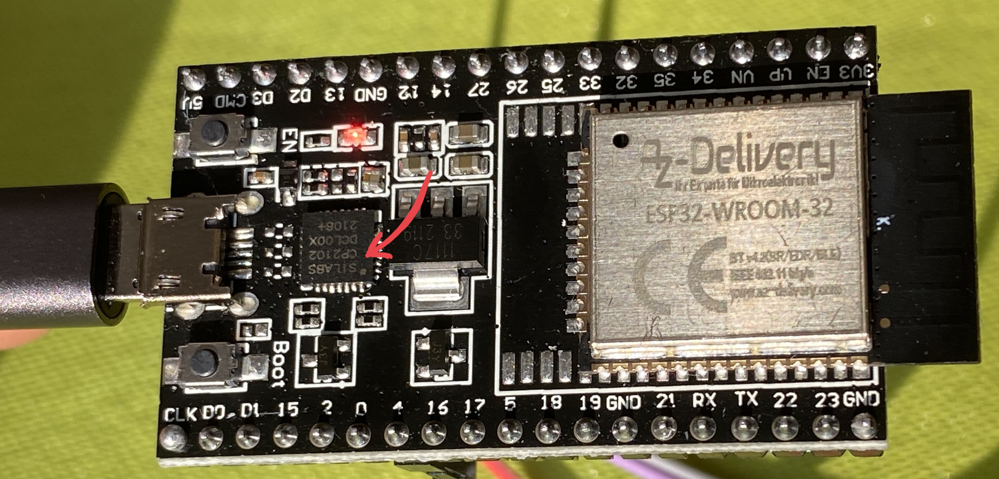
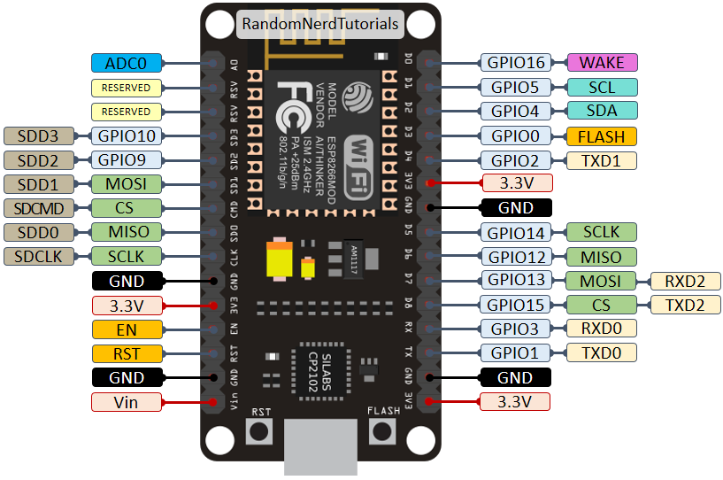

# FAQ
## Si l'esp n'ai pas reconnu
- changer de cable USB
- Changer d'adaptateur  
- installer le driver associé à l'esp (voir model sur le microprocesseur)    
- vérifier dans /dev si le port existe bien   

## Impossibible de téléverser le code

 

Il faut presser sur RESET + GPIO0 au moment du téléchargement. Attention il y a 3 boutons sur certain modèl ! Utiliser celui sous l’ESP et le GPIO0 du support.

ATTENTION : Il faut ensuite débrancher puis rebrancher l’ESP

Vidéo : https://youtu.be/v8s-UMqcTJs 

Si cela ne fonctionne toujours pas
- débrancher l'alim. de l'esp (pin 5v ou 3.3v)
- débrancher toutes les pin et recommencer.

## Corespondance Dx -> GPIOx
 
