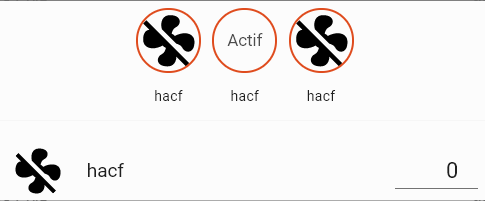

# Faire un plan

## pour changer le plan de la maison
* faire une image SVG
* cd /Users/hasen/MyBoxInria/Seafile/Perso/+\ Home\ Assistant  
* scp planMaison.svg root@xx.xx.xx.xx:/root/config/www/images/planMaison.svg 
* pour vérifier : ssh root@xx.xx.xx.xx

## Animation de badges
https://forum.hacf.fr/t/animation-badges/3934

