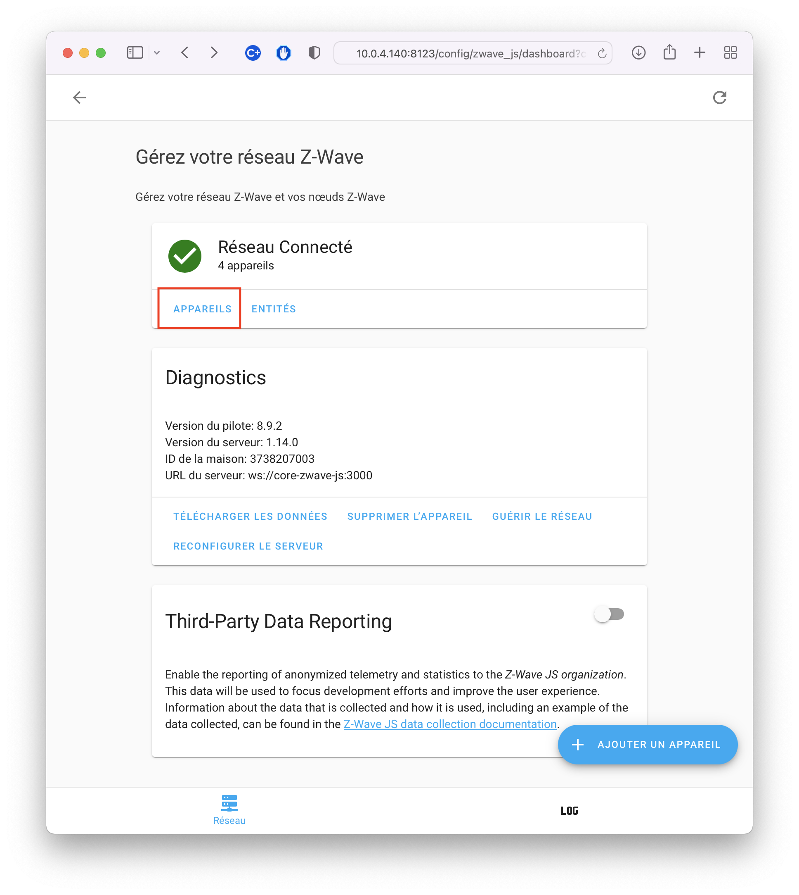
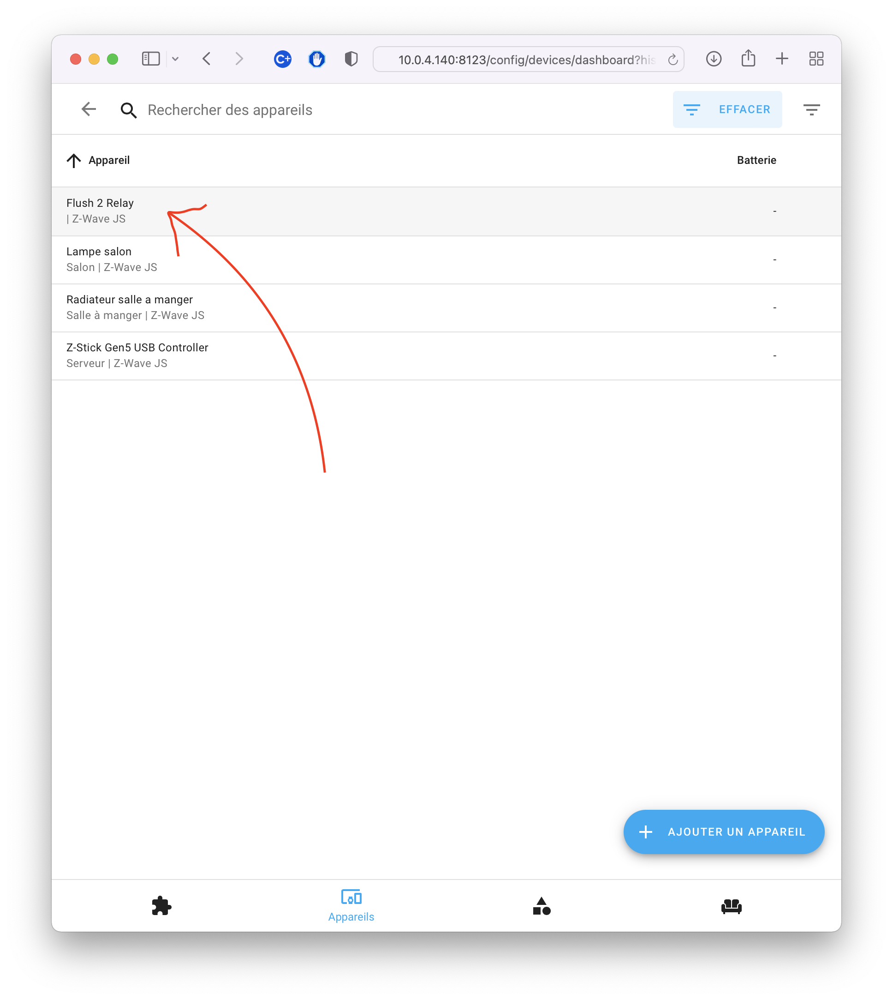
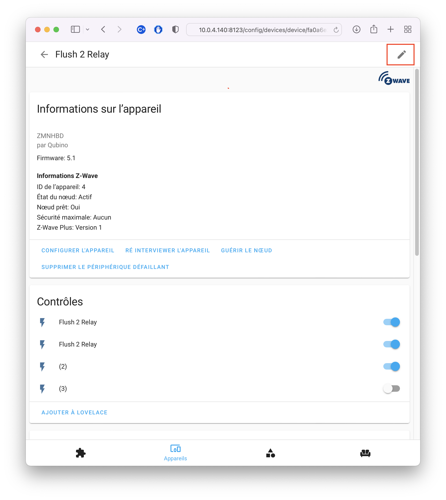
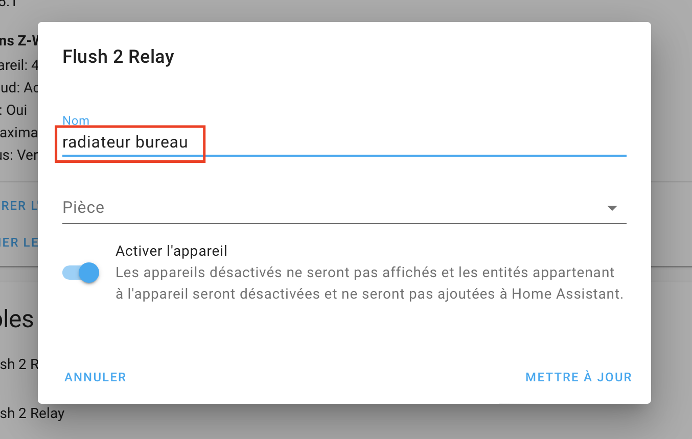
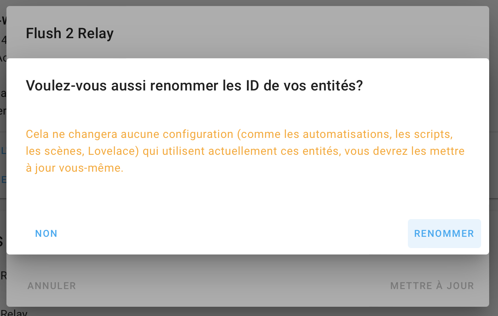

# Installation relais radiateur électrique

## Modèle

Sur le site de Qubino : https://qubino.com/products/flush-2-relays/

## Cablage
Remplacer l'ampoule par le radiateur !!!

## Config Home Assistant

## Renommer le relay

