# Installation relais radiateur électrique

## Modèle
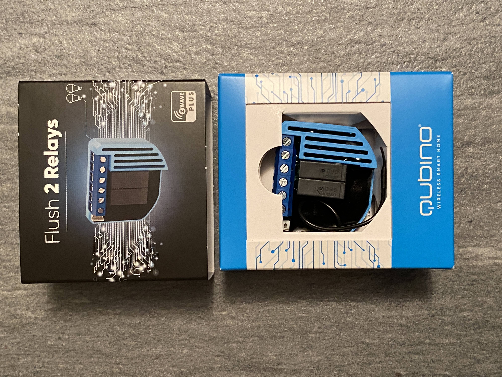
Sur le site de Qubino : https://qubino.com/products/flush-2-relays/

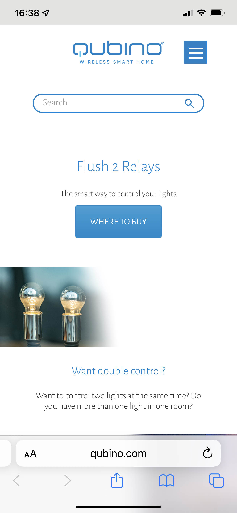
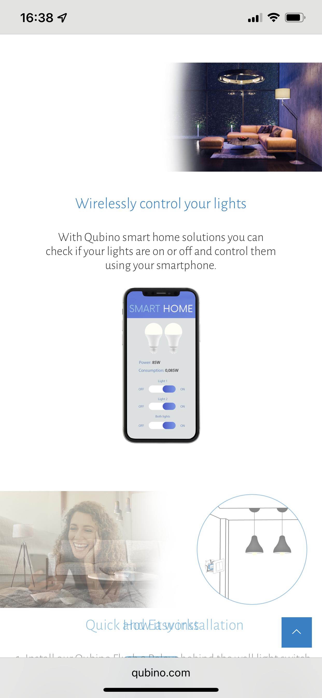
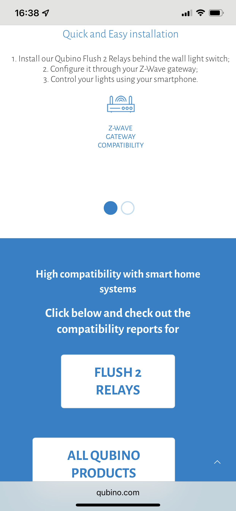
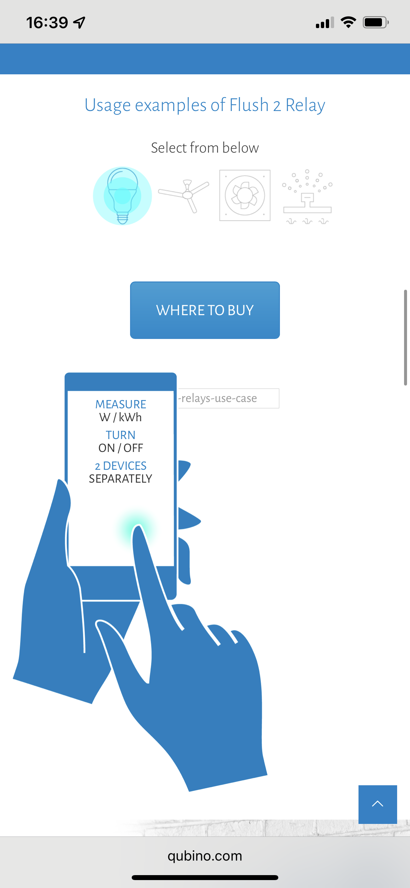
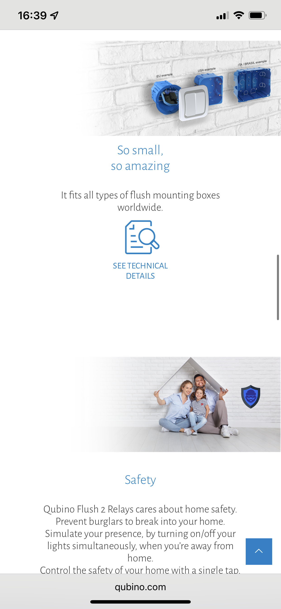

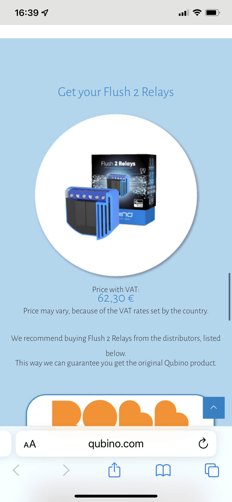

## Cablage
Remplacer l'ampoule par le radiateur
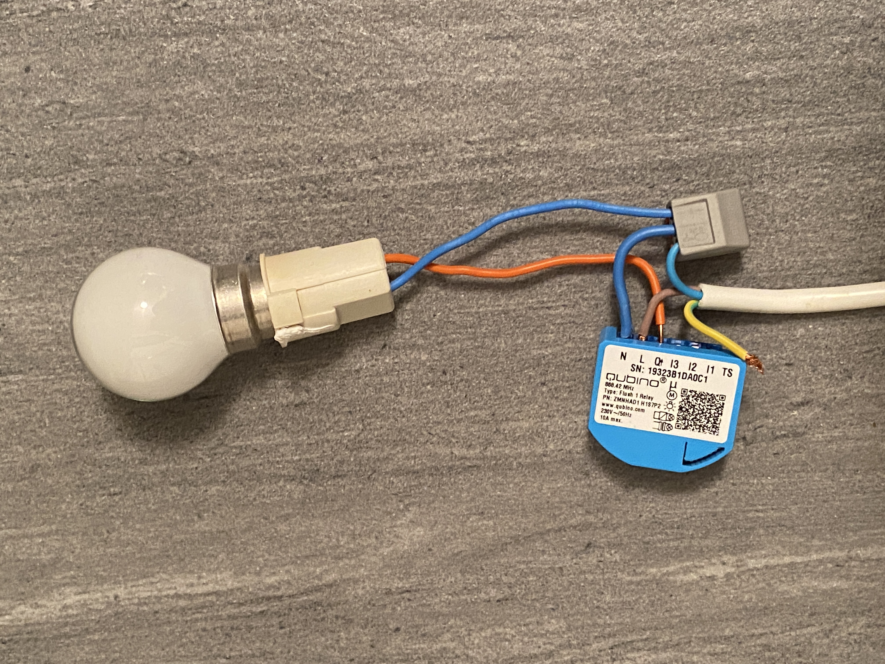
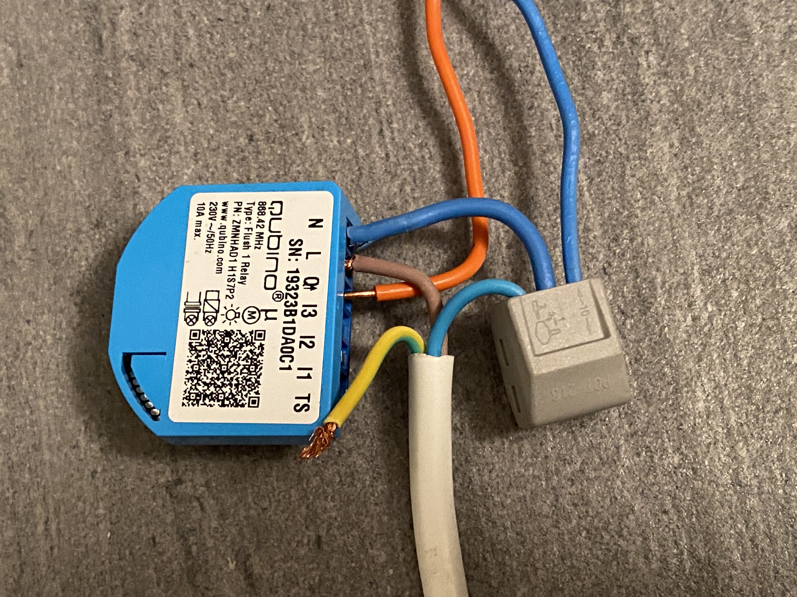

## Config Home Assistant

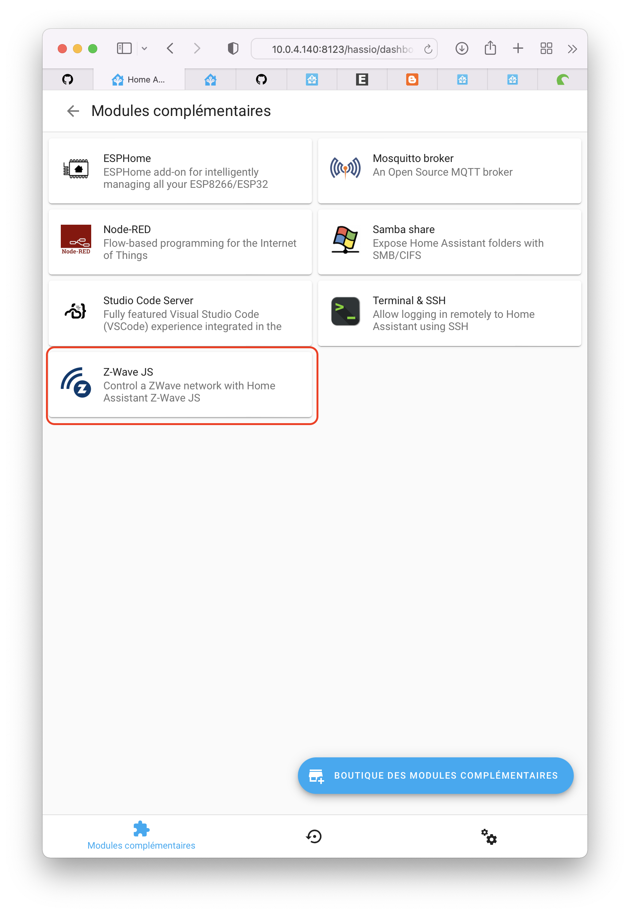
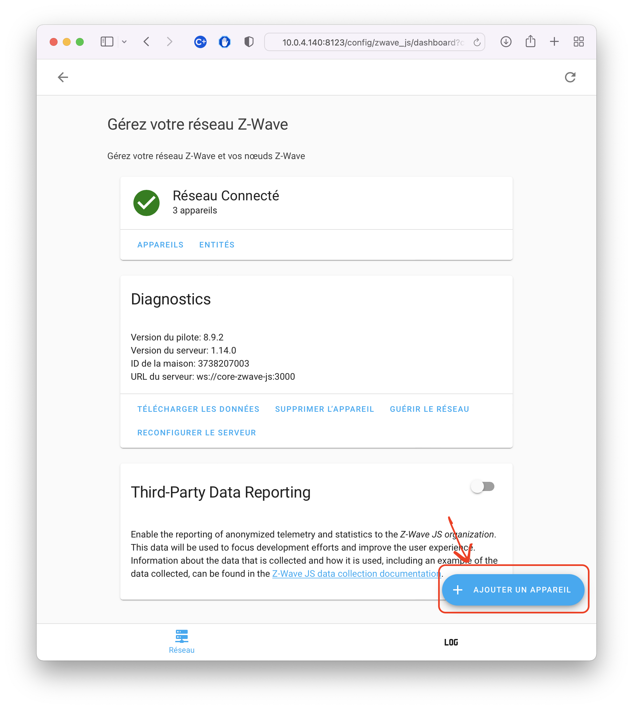
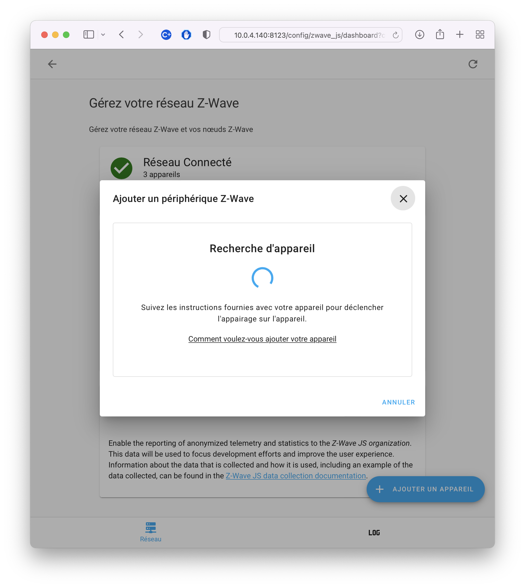
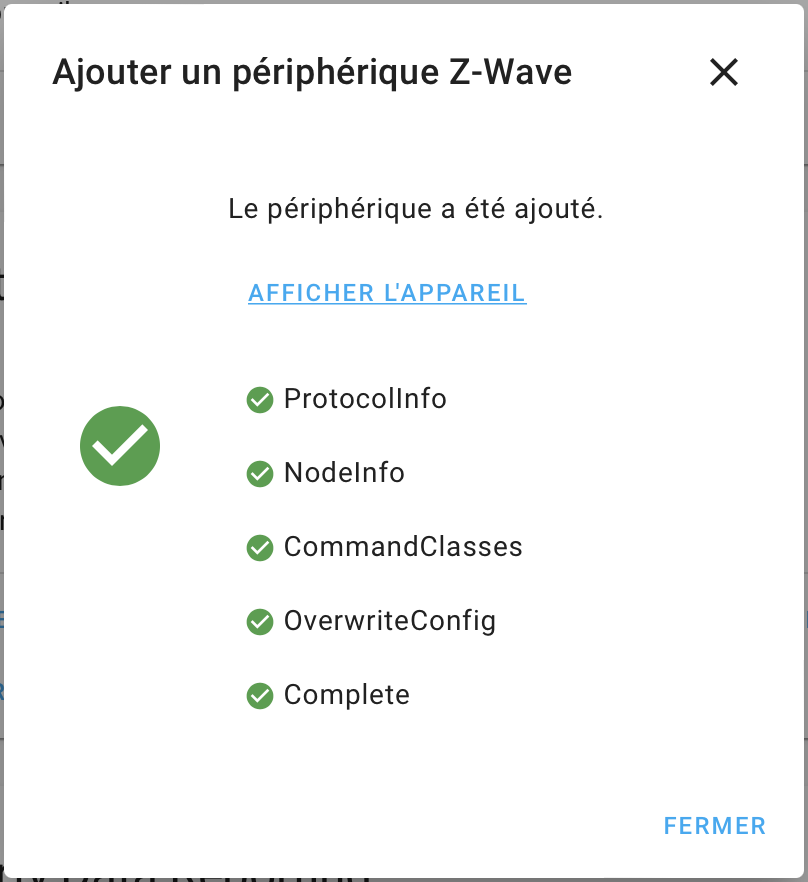

