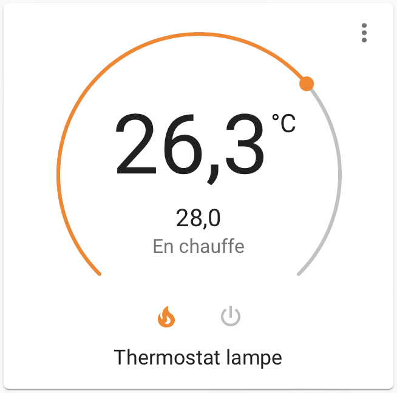
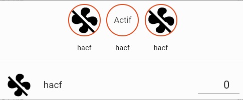

# Thermostat







Dans config.yaml

```
# Thermostat generic- jmh 31/12/2021
# https://www.home-assistant.io/integrations/generic_thermostat/
climate:
  - platform: generic_thermostat
    name: Thermostat lampe
    heater: switch.lampe_salon
    target_sensor: sensor.wemos_2_temperature
    min_temp: 15
    max_temp: 34
    target_temp: 28

    # Réglez l'interrupteur spécifié dans l'option de chauffage 
    # pour qu'il soit traité comme un dispositif de refroidissement
    # au lieu d'un dispositif de chauffage.
    ac_mode: false

    cold_tolerance: 0.3

    # Définissez une différence minimale entre la température 
    # lue par le capteur spécifié dans l'option target_sensor 
    # et la température cible qui doit changer avant d'être 
    # éteinte. Par exemple, si la température cible est de 
    # 25 et que la tolérance est de 0,5, le chauffage s'arrêtera
    # lorsque le capteur sera égal ou supérieur à 25,5.
    hot_tolerance: 0.5
    
    # Définissez un minimum de temps pendant lequel l'interrupteur 
    # spécifié dans l'option chauffage doit être dans son état 
    # actuel avant d'être éteint ou allumé.
    min_cycle_duration:
      minutes: 10
      # Définissez un intervalle de maintien en intervalle. 
      # S'il est réglé, le commutateur spécifié dans l'option de 
      # chauffage sera déclenché chaque fois que l'intervalle 
      # s'écoulera. Utilisez-le avec des appareils de chauffage 
      # et des unités de climatisation qui s'éteignent s'ils 
      # ne reçoivent pas de signal de leur télécommande pendant un 
      # certain temps. Utilisez également avec des commutateurs 
      # qui pourraient perdre de l'état. L'appel keep-alive se fait 
      # avec l'état actuel d'intégration climatique valide (on ou off).
      ## keep_alive:
      ##   minutes: 3

    # Set the initial HVAC mode. Valid values are 'off', 'heat' or 'cool'. 
    # Value has to be double quoted. If this parameter is not set, 
    # it is preferable to set a keep_alive value. This is helpful 
    # to align any discrepancies between generic_thermostat and
    # heater state.
    initial_hvac_mode: "off"
  
    # Définissez la température utilisée par preset_mode: away. 
    # Si ce n'est pas spécifié, la fonctionnalité de mode prédéfini 
    # ne sera pas disponible.
    away_temp: 16

    # The desired precision for this device. Can be used to
    # match your actual thermostat’s precision.
    # Supported values are 0.1, 0.5 and 1.0. This value is also
    # used as the step size for setting the target temperature.
    # Default: 0.1 for Celsius and 1.0 for Fahrenheit.
    precision: 0.1
```